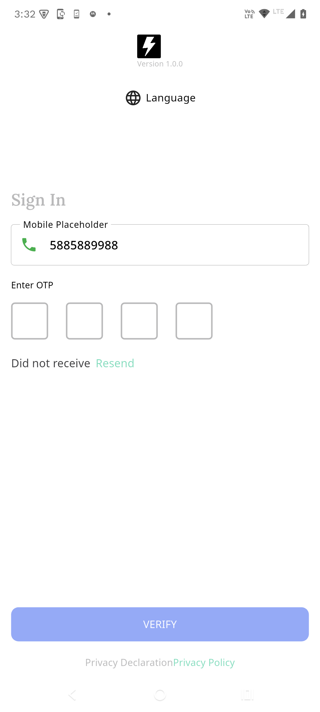
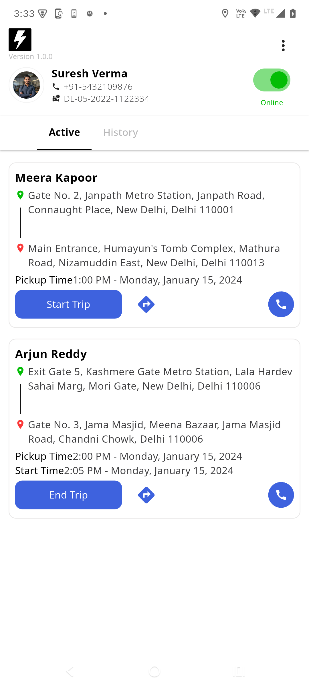
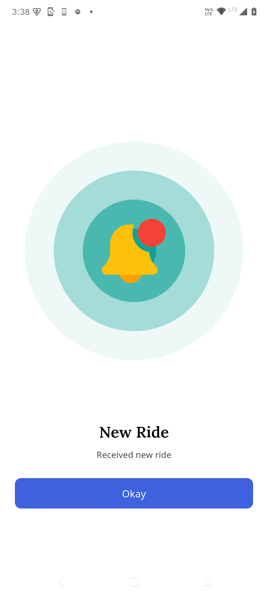
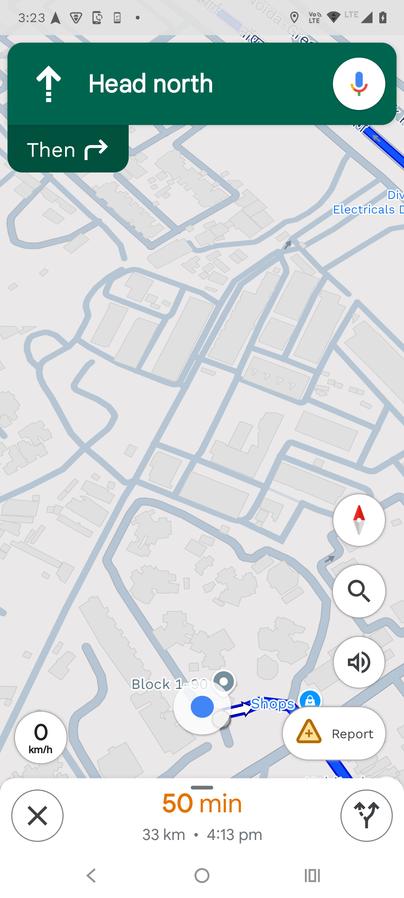

# 🚗 Eazy Rider App

A comprehensive Flutter-based rider application that enables drivers to manage rides, view assignments, and handle customer deliveries efficiently.

## 📱 Overview

Eazy Rider is a mobile application designed for drivers (riders) who receive ride assignments from customers. The app provides a seamless experience for managing active rides, viewing future assignments, and handling the complete ride lifecycle from start to completion.

## 📸 App Screenshots

<div align="center">
  
  
  
  
</div>

## ✨ Features

### 🎯 Core Functionality
- **Ride Management**: View and manage active rides assigned to the rider
- **Future Rides**: See upcoming ride assignments and schedules
- **Ride Lifecycle**: Start, complete, and track ride progress
- **Real-time Updates**: Live status updates and notifications 

### 🚀 Key Features
- **Authentication System**: Secure login and user management
- **Profile Management**: Rider profile with personal information and preferences
- **Location Services**: GPS tracking and location-based features
- **Push Notifications**: Real-time alerts for new rides and updates
- **Multi-language Support**: Hindi and English localization
- **Background Services**: Continuous operation for ride monitoring
- **Web Support**: Cross-platform compatibility including web browsers

### 📊 Dashboard & Analytics
- **Active Rides Tab**: View current ride assignments
- **History Tab**: Access completed ride records
- **Statistics**: Performance metrics and earnings tracking
- **Status Indicators**: Visual ride status and progress tracking

## 🛠️ Technology Stack

### Frontend
- **Framework**: Flutter 3.8+
- **Language**: Dart 3.8+
- **State Management**: Provider pattern
- **UI Components**: Material Design 3
- **Localization**: Flutter Intl

### Backend Integration
- **Firebase Services**:
  - Firebase Authentication
  - Firebase Analytics
  - Firebase Crashlytics
  - Firebase Messaging (Push Notifications)
  - Firebase Remote Config
- **APIs**: RESTful API integration for ride data
- **Real-time Updates**: WebSocket connections

### Platform Support
- ✅ Android (API 21+)
- ✅ iOS (iOS 12.0+)
- ✅ Web (Chrome, Firefox, Safari, Edge)
- ✅ macOS
- ✅ Linux
- ✅ Windows

## 📋 Prerequisites

Before running this project, ensure you have the following installed:

- **Flutter SDK**: 3.8.0 or higher
- **Dart SDK**: 3.8.0 or higher
- **Android Studio**: Latest version with Android SDK
- **Xcode**: 14.0+ (for iOS development)
- **Git**: For version control
- **Firebase Account**: For backend services

## 🚀 Installation & Setup

### 1. Clone the Repository
```bash
git clone <repository-url>
cd easy_rider
```

### 2. Install Dependencies
```bash
flutter pub get
```

### 3. Firebase Configuration

#### Android Setup
1. Download `google-services.json` from Firebase Console
2. Place it in `android/app/google-services.json`

#### iOS Setup
1. Download `GoogleService-Info.plist` from Firebase Console
2. Place it in `ios/Runner/GoogleService-Info.plist`

#### Web Setup
1. Configure Firebase for web in `lib/firebase_options.dart`

### 4. Environment Configuration
Create a `.env` file in the root directory:
```env
API_BASE_URL=your_api_base_url
FIREBASE_PROJECT_ID=your_firebase_project_id
```

### 5. Run the Application

#### For Android
```bash
flutter run -d android
```

#### For iOS
```bash
flutter run -d ios
```

#### For Web
```bash
flutter run -d chrome
```

## 📱 App Structure

```
lib/
├── auth/                    # Authentication module
│   ├── application/         # Auth business logic
│   ├── infrastructure/      # Auth API services
│   ├── model/              # Auth data models
│   └── presentation/       # Auth UI screens
├── core/                   # Core functionality
│   ├── application/        # App-wide state management
│   ├── constants/          # App constants and configurations
│   ├── libs/              # Shared libraries and services
│   ├── model/             # Core data models
│   ├── presentation/      # Shared UI components
│   └── shared/            # Shared utilities
├── home/                   # Home screen module
│   ├── application/        # Home business logic
│   ├── infrastructure/     # Home API services
│   └── presentation/       # Home UI components
├── ride/                   # Ride management module
│   ├── application/        # Ride business logic
│   ├── infrastructure/     # Ride API services
│   ├── model/             # Ride data models
│   └── presentation/      # Ride UI screens
├── splash/                 # Splash screen
├── web/                    # Web-specific components
└── main.dart              # App entry point
```

## 🔧 Configuration

### Android Configuration
- **Minimum SDK**: API 21 (Android 5.0)
- **Target SDK**: API 35 (Android 14)
- **Compile SDK**: API 35
- **Kotlin Version**: 2.0.21
- **Gradle Plugin**: 8.1.0

### iOS Configuration
- **Minimum iOS Version**: 12.0
- **Swift Version**: 5.0
- **Deployment Target**: iOS 12.0

### Web Configuration
- **Target**: Modern browsers (Chrome 90+, Firefox 88+, Safari 14+)
- **Build**: Optimized for web deployment

## 📦 Dependencies

### Core Dependencies
- `flutter`: ^3.8.0
- `firebase_core`: ^3.14.0
- `firebase_auth`: ^5.3.0
- `firebase_analytics`: ^11.5.0
- `firebase_messaging`: ^15.2.7
- `firebase_crashlytics`: ^4.3.7
- `provider`: ^6.1.5
- `connectivity_plus`: ^6.1.4
- `geolocator`: ^10.1.1
- `shared_preferences`: ^2.5.3
- `path_provider`: ^2.1.2
- `permission_handler`: ^12.0.0

### UI Dependencies
- `flutter_svg`: ^2.2.0
- `lottie`: ^3.3.1
- `carousel_slider`: ^5.1.1
- `flutter_local_notifications`: ^19.3.0
- `webview_flutter`: ^4.13.0

### Development Dependencies
- `flutter_launcher_icons`: ^0.13.1
- `flutter_native_splash`: ^2.4.6
- `build_runner`: ^2.5.4
- `json_serializable`: ^6.9.5

## 🎨 UI/UX Features

### Design System
- **Material Design 3**: Modern, adaptive design
- **Responsive Layout**: Works on all screen sizes
- **Dark/Light Theme**: Automatic theme switching
- **Custom Icons**: Brand-specific iconography
- **Animations**: Smooth transitions and micro-interactions

### Accessibility
- **Screen Reader Support**: VoiceOver and TalkBack compatibility
- **High Contrast**: Enhanced visibility options
- **Font Scaling**: Dynamic text sizing
- **Touch Targets**: Adequate button sizes for easy interaction

## 🔐 Security Features

- **Secure Authentication**: Firebase Auth with email/password
- **Data Encryption**: Sensitive data encryption at rest
- **API Security**: HTTPS-only API communications
- **Token Management**: Secure token storage and refresh
- **Permission Handling**: Granular permission requests

## 📊 Analytics & Monitoring

- **Firebase Analytics**: User behavior tracking
- **Crashlytics**: Crash reporting and monitoring
- **Performance Monitoring**: App performance metrics
- **Custom Events**: Business-specific event tracking

## 🌐 Localization

The app supports multiple languages:
- **English** (Default)
- **Hindi** (हिंदी)

### Adding New Languages
1. Add translations to `lib/core/libs/packages/localizations.dart`
2. Update the language selector in `lib/language/`
3. Test with different locales

## 📦 Building for Production

### Android APK
```bash
flutter build apk --release
```

### Android App Bundle
```bash
flutter build appbundle --release
```

### iOS Archive
```bash
flutter build ios --release
```

### Web Build
```bash
flutter build web --release
```

## 🚀 Deployment

### Google Play Store
1. Build app bundle: `flutter build appbundle --release`
2. Upload to Google Play Console
3. Configure store listing and release

### Apple App Store
1. Build iOS archive: `flutter build ios --release`
2. Upload to App Store Connect
3. Configure app metadata and release

### Web Deployment
1. Build web assets: `flutter build web --release`
2. Deploy to hosting service (Firebase Hosting, Netlify, etc.)

## 🤝 Contributing

1. Fork the repository
2. Create a feature branch: `git checkout -b feature-name`
3. Make your changes and commit: `git commit -m 'Add feature'`
4. Push to the branch: `git push origin feature-name`
5. Submit a pull request

### Code Style
- Follow Dart/Flutter style guidelines
- Use meaningful variable and function names
- Add comments for complex logic
- Write unit tests for features

## 📄 License

This project is licensed under the MIT License - see the [LICENSE](LICENSE) file for details.

## 🆘 Support

### Common Issues

#### Build Issues
- **Kotlin Version Conflicts**: Update Kotlin version in `android/build.gradle`
- **Dependency Conflicts**: Run `flutter clean && flutter pub get`
- **Firebase Configuration**: Ensure all Firebase files are properly placed

#### Runtime Issues
- **Location Permissions**: Grant location permissions in device settings
- **Network Issues**: Check internet connectivity and API endpoints
- **Authentication**: Verify Firebase configuration and credentials

### Getting Help
- **Documentation**: Check the inline code comments
- **Issues**: Create an issue on GitHub
- **Discussions**: Use GitHub Discussions for questions

## 📈 Roadmap

### Upcoming Features
- [ ] Real-time chat with customers
- [ ] Earnings dashboard
- [ ] Offline mode enhancements
- [ ] Multi-language support expansion
- [ ] Advanced analytics dashboard

### Performance Improvements
- [ ] Image optimization
- [ ] Lazy loading implementation
- [ ] Memory usage optimization
- [ ] Battery usage optimization

---

**Made with ❤️ in G-Town**

